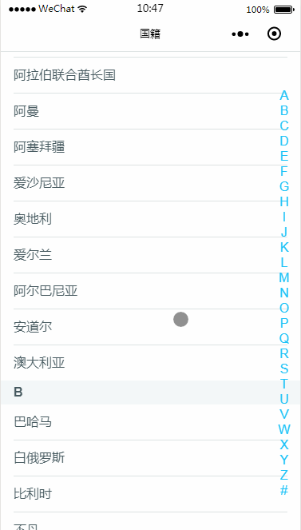
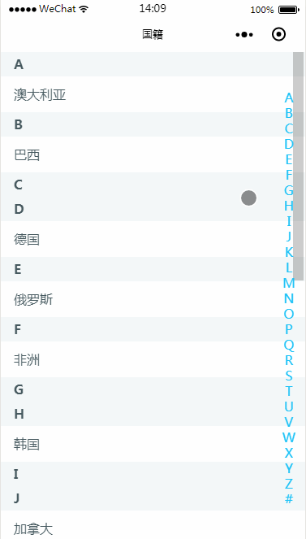

### sortPickerList

* 版本号`1.0.1`
* 原生小程序版github地址: [https://github.com/nickrogit/wxaSortPicker](https://github.com/nickrogit/wxaSortPicker)


### 版本说明
* 1.0.1版本,优化uni-app非H5端不支持的语法
* 1.0.0版本json数组支持，如：[{name:'中国',value:'China'},{name:'美国',value:'America'}]，value取值e.target.dataset.value，其他不变
* 解析汉字编码排序，常用json格式数据，结构简单方便，再也不用自己整理字母分类啦。（目前市场插件都需要按字母分类自己写固定格式）


### 功能

* 字符串数组首字母排序
* 右侧点击字母定位
* 点击item返回数据

### 开发要点

* 解析汉字Unicode编码并排序，
* 小程序scroll-view组件的scroll-into-view属性，点击右侧字母改变scroll-into-view的属性值，定位。
* scroll-into-view（值应为某子元素id（id不能以数字开头）。设置哪个方向可滚动，则在哪个方向滚动到该元素），


### 适用场景

 * 城市、国籍、通讯录等字母排序
 
## 功能预览






## 使用方式

* 引入相关文件并初始化，详情参看pages/country.vue

```
<template>
	<view>
		<SortPickerList ref="sortPickerList" @clickData="clickData"></SortPickerList>
	</view>
</template>
<script>
	import SortPickerList from "@/components/nickro-sortPickerList.vue"
	export default {
		name:"contury",
		components: {SortPickerList},
		data() {
			return {
				dataArr: [
					{ name: '中国', value: 'China'},
					{ name: '俄罗斯', value: 'Russia' },
					{ name: '美国', value: 'America' },
					{ name: '澳大利亚', value: 'Australia' },
					{ name: '巴西', value: 'Brazil' },
					{ name: '韩国', value: 'Korea' },
					{ name: '朝鲜', value: 'North Korea' },
					{ name: '英国', value: 'Britain' },
					{ name: '德国', value: 'Germany' },
					{ name: '加拿大', value: 'Canada' },
					{ name: '非洲', value: 'New Zealand' },
				]
			}
		},
		onShow() {
			var that = this
			uni.setNavigationBarTitle({
					title: '自动处理索引列表'
			});
		},
		onReady() {
			var that = this
			that.$refs["sortPickerList"].initPage(that.dataArr)
		},
		methods: {
			clickData(data) {
				console.log('获取名：' + data.label)
				console.log('获取值：' + data.value)
			}
		}
	}
</script>

<style>
	
</style>

```

